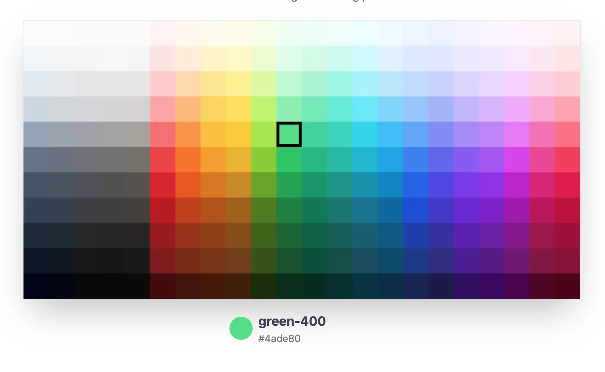
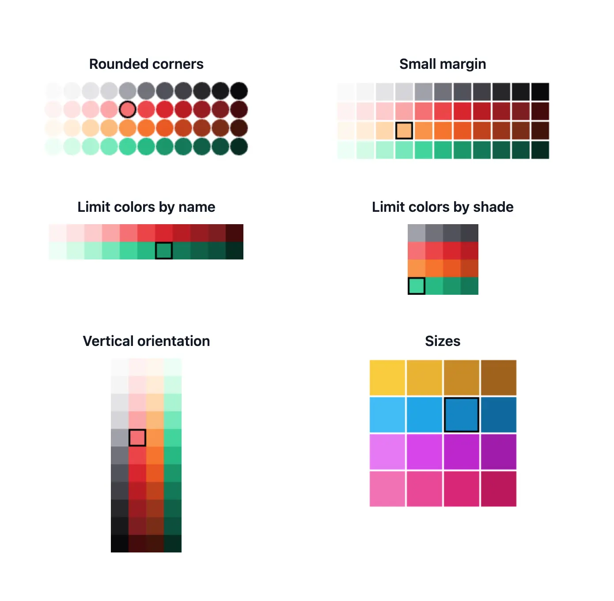

# Tailwind Color Picker for Svelte

A simple, customizable color picker component for Svelte that uses Tailwind CSS color palettes.

[Live Demo](https://svelte-tailwind-colorpicker.pages.dev/)



## Features

- HTML Canvas for optimal performance
- Flexible color options: Use Tailwind default colors or your own
- Lightweight with no dependencies
- Customizable appearance (size, margins, borders, rounded corners)
- Vertical or horizontal orientation
- Ability to limit color and shade choices



## Installation

```bash
npm i svelte-tailwind-colorpicker
```

## Usage

1. Import the component in your Svelte file:

```svelte
import TailwindColorPicker from 'svelte-tailwind-color-picker';
```

2. Use the component in your Svelte template:

```svelte
<TailwindColorPicker bind:activeSwatch />
```

3. Access the selected color:

```svelte
{#if activeSwatch}
	<p>Selected color: {activeSwatch.color}-{activeSwatch.shade} ({activeSwatch.swatch.hex})</p>
{/if}
```

## Props

| Prop            | Type                       | Default      | Description                      |
| --------------- | -------------------------- | ------------ | -------------------------------- |
| swatchSize      | number                     | 35           | Size of each color swatch        |
| swatchMargin    | number                     | 0            | Margin between swatches          |
| borderColor     | string                     | '#000000'    | Border color of swatches         |
| borderThickness | number                     | 4            | Border thickness of swatches     |
| roundedCorners  | boolean                    | false        | Enable rounded corners           |
| cornerRadius    | number                     | 0            | Radius of rounded corners        |
| orientation     | 'horizontal' \| 'vertical' | 'horizontal' | Orientation of the color picker  |
| includeColors   | string[]                   | all colors   | Array of color names to include  |
| includeShades   | string[]                   | all shades   | Array of shade values to include |
| activeSwatch    | ActiveSwatch \| null       | null         | Currently active swatch (optional) |
| palette         | ColorGroup[]               | tailwindColors | Custom color palette           |

## Examples

### Basic Usage

```svelte
<TailwindColorPicker bind:activeSwatch />
```

### Customized Appearance

```svelte
<TailwindColorPicker
	swatchSize={40}
	swatchMargin={2}
	borderColor="#cccccc"
	borderThickness={2}
	roundedCorners={true}
	cornerRadius={8}
	orientation="vertical"
	includeColors={['red', 'blue', 'green']}
	includeShades={['400', '500', '600']}
	bind:activeSwatch
/>
```

### Handling Color Selection

```svelte
<script>
	import TailwindColorPicker from 'svelte-tailwind-color-picker';
	import type { ActiveSwatch } from 'svelte-tailwind-color-picker';

	let activeSwatch: ActiveSwatch | null = null;

	function handleColorChange(event: CustomEvent<ActiveSwatch>) {
		const selectedSwatch = event.detail;
		console.log(`Selected color: ${selectedSwatch.color}-${selectedSwatch.shade}`);
		console.log(`Hex value: ${selectedSwatch.swatch.hex}`);
	}
</script>

<TailwindColorPicker bind:activeSwatch on:change={handleColorChange} />
```

### Using a Custom Palette

```svelte
<script>
	import TailwindColorPicker from 'svelte-tailwind-color-picker';
	import type { ColorGroup } from 'svelte-tailwind-color-picker';

	const customPalette: ColorGroup[] = [
		{
			name: 'customRed',
			swatches: {
				'500': { hex: '#ff0000' },
				'600': { hex: '#cc0000' },
				'700': { hex: '#990000' },
			}
		},
		// Add more custom color groups as needed
	];
</script>

<TailwindColorPicker palette={customPalette} />
```

## Development

To set up the project for development:

1. Clone the repository
2. Install dependencies with `npm install`
3. Start the development server with `npm run dev`

## Building

To build the library:

```bash
npm run package
```

## Publishing

To publish the library to npm:

1. Update the version in `package.json`
2. Build the package
3. Run `npm publish`

## License

MIT License
